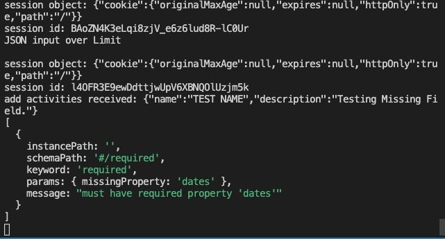
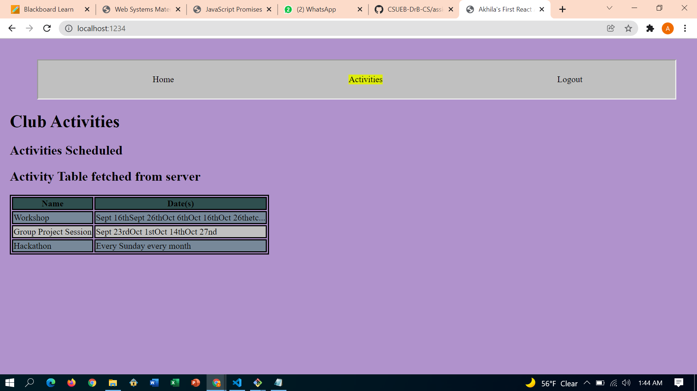

**Student Name**:  Akhila Reddy Bukkasamudram

**NetID**: cl2103

# Homework 12
## (1)
### (a)
```javascript
import DataStore from "nedb-promises";

import { readFile } from "fs/promises";


const activitydb = DataStore.create("./activityDB");

const memberdb = DataStore.create("./memberDB");

const activitiesFile = JSON.parse(

    await readFile(new URL("./activity.json", import.meta.url))

  );

const memberFile = JSON.parse(

    await readFile(new URL("./clubUsers3Hash.json", import.meta.url))

  );


async function clearInsert(){    

    await activitydb.remove({}, { multi: true });

    await memberdb.remove({}, { multi: true });  

    await activitydb.insert(activitiesFile)

    await memberdb.insert(memberFile)

}  


clearInsert()
```

### (b)
```javascript
app.get('/members', adminMiddleware, async function (req, res) {
    let firstAndLast = await membersDB.find({},{firstName: 1, lastName:1});
    res.json(firstAndLast);
});
```

### (c)
```javascript
// display the activities on server
app.get('/activities',jsonParsor, async function (req, res) {
    let activities = await activitiesDB.find({});
    res.json(activities);
});

// post the updated activities after adding a new activity
app.post('/activities', userMiddleware, adminMiddleware, jsonParsor, async function (req, res) {
    console.log('adding an activity received:  ${JSON.stringyfy(req.body)}');
    let activity = req.body;

    let valid = activityValidate(activitySchema, activity);
    //hw12 insert activity into database
    if(!valid){
        console.log(activityValidate.errors);
        res.status(400).json({error: "bad activity"});
        return;
    } 
    await activitiesDB.insert(activity);
    let activities = await activitiesDB.find({});
    res.json(activities);   
}, jsonErrors);


app.delete("/activities/:id", adminMiddleware,jsonParsor, async function (req, res) {
    console.log("req params", req.params.id)
    // let index = parseInt(req.params.id);
    // activities.splice(index,1);
    //hw12
    await activitiesDB.remove({_id: req.params.id});
    let activities = await activitiesDB.find({});
    res.json(activities);
});
```

## (2)

### (a)
No modifications

### (b)
No modifications


## (3)
### (a)
1. clubReact development Parcel bundler is running on `http://localhost:1234` with host - `localhost` and TCP port - `1234`

2. clubServer development Parcel bundler is running on `http://localhost:2020` with host - `localhost` and TCP port - `2020` (This is explicitely specified).

### (b)
```
{
    "/activities": {
        "target": "http://127.10.41.5:2050"
    }
}
```
## (4)
### (a)
### (b)
```javascript
import React from 'react';

class Activities extends React.Component{
    constructor(props){
        super(props);
        this.state = { activities:[]}
    }

componentDidMount() {
      
    fetch('/activities').then(res=>res.json()).then((activities)=>{
        this.setState({
            ...this.state,
            activities: activities
        })
    })
}

render(){
    console.log(this.state.activities);
    let tableRows = this.state.activities.map((events1) => {
        return <tr>
                  <td>{events1.name}</td>
                  <td>{events1.dates}</td>
              </tr>;
    })
      // Create a table using rows from above
     let myTable = <table>
                       <thead>
                           <tr>
                               <th>Name</th><th>Date(s)</th></tr>
                         </thead>
                            <tbody id="ActTable">
                             {tableRows}
                            </tbody>
                     </table>;
    return(
            <>
                <div id="actvitytable">
                      <h1>Club Activities </h1>
           
                    <h2>Activities Scheduled</h2>
                <ul>
                    <li></li>
                    <li></li>
                    <li></li>
                </ul> 
                 <h2> Activity Table fetched from server</h2>
                      {myTable}
                </div>
            </>
    );
}

}

export default Activities
```

