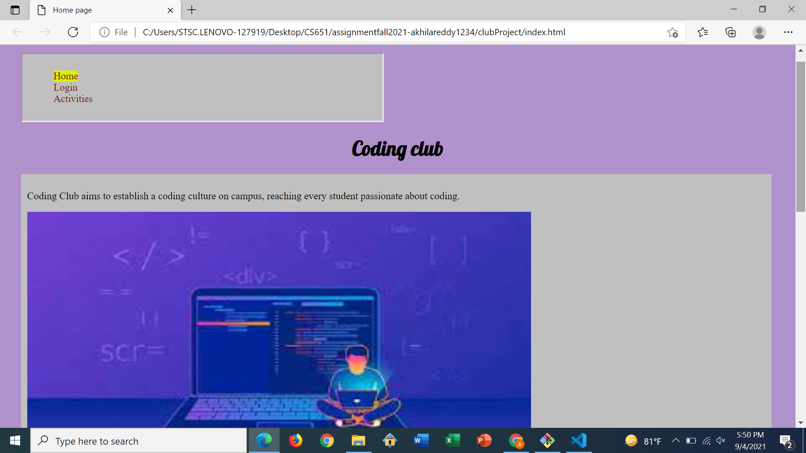
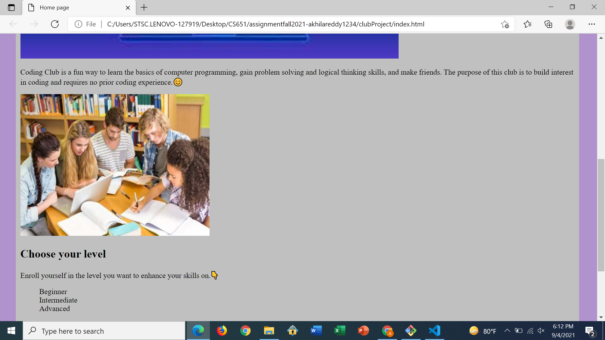
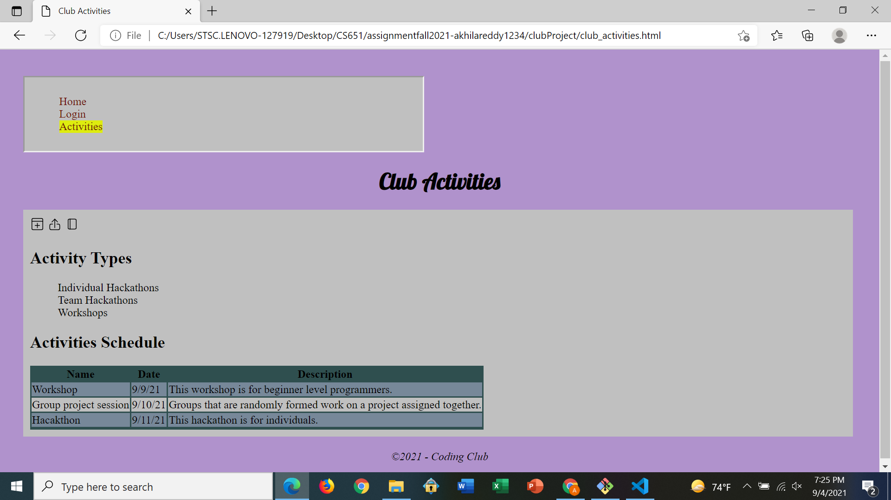
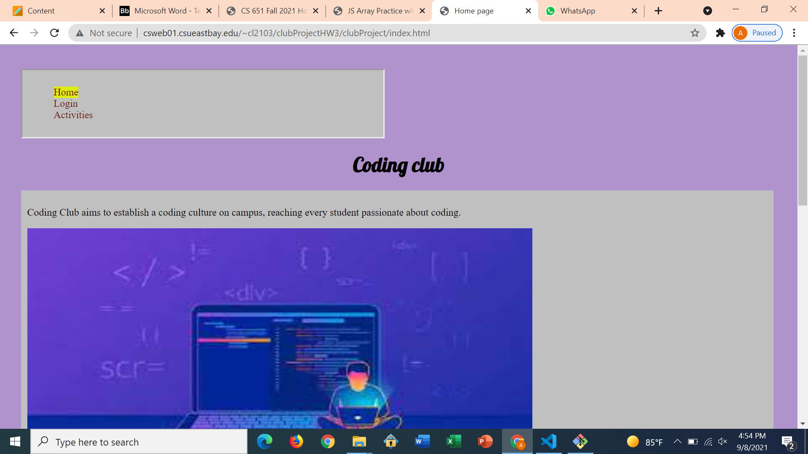

**Student Name**:  Akhila Reddy Bukkasamudram

**NetID**: cl2103

# Homework 3
## (1)

### (a)


### (b)


## (2)
### (a)

### (b)
```
<table>
  <thead>
    <tr>
      <th>Name</th>
        <th>Date</th>
        <th>Description</th>
    </tr>      
  </thead>
  <tbody>
    <tr>
      <td>Workshop </td>
      <td>9/9/21</td>
      <td>This workshop is for beginner level programmers.</td>
    </tr>

    <tr>
      <td>Group project session</td>
      <td>9/10/21</td>
      <td>Groups that are randomly formed work on a project assigned together.</td>
    </tr>

    <tr>
      <td>Hacakthon</td>
      <td>9/11/21</td>
      <td>This hackathon is for individuals.</td>
    </tr>
  </tbody>
</table>
```

### (c)


## (3)

### (a)



### (b)

[link to the club site](http://csweb01.csueastbay.edu/~cl2103/clubProjectHW3/clubProject/)

## (4)

### (a)

```
states.length

```

### (b)

```
function total_US_Population(total_population, current_value){
    return total_population + current_value.population
}


states.reduce(total_US_Population,0)

```

### (c)

```
function compare_states(state1,state2){
    return state2.population - state1.population
}
states.sort(compare_states)
state_names = states.map(state => state.state)
console.log(state_names.slice(0,5))

```