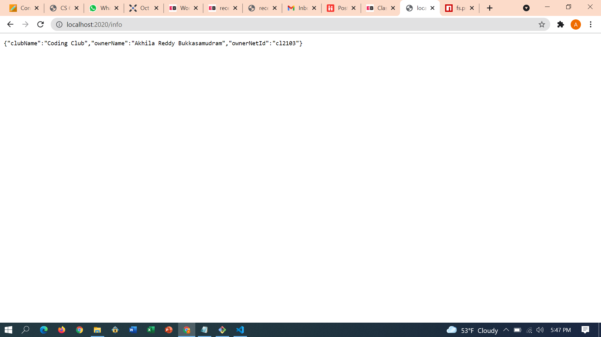
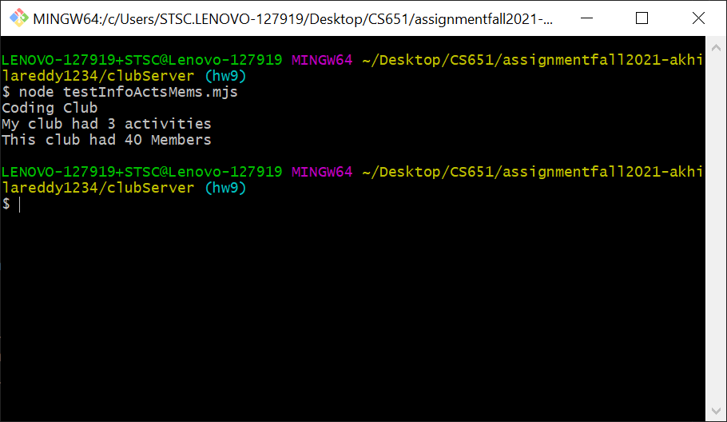
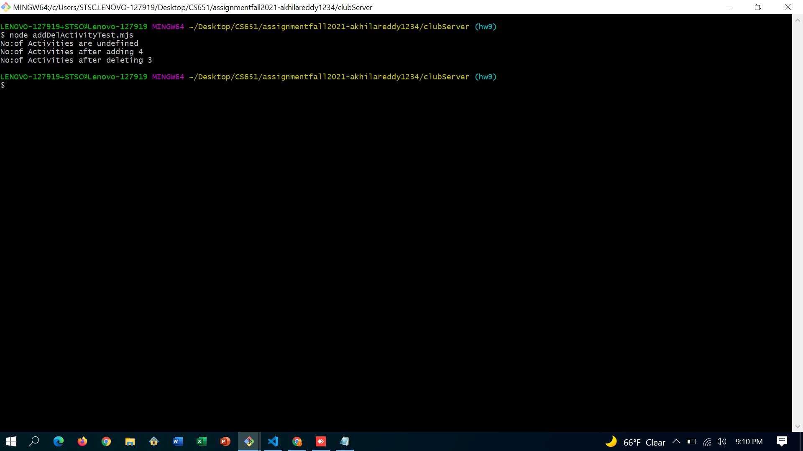
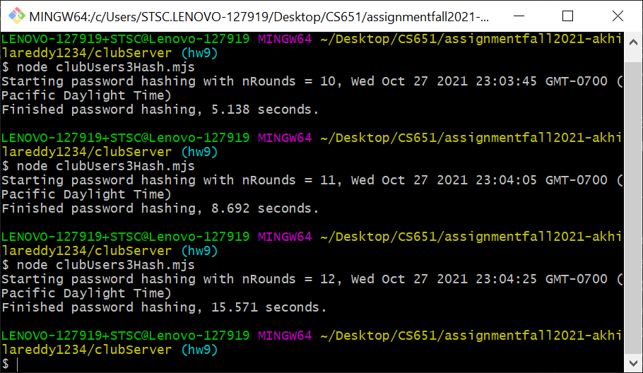

**Student Name**:  Akhila Reddy Bukkasamudram

**NetID**: cl2103

# Homework 9
## (1)
### (a)


### (b)
```javascript
import express  from 'express';
import { readFile }  from 'fs/promises';
import fs from 'fs';


let app = express();
const activities = JSON.parse(await readFile(new URL('../clubReact/event_data.json',
    import.meta.url)))

app.get('/activities', function(req,res){
    res.send({activities});
});
```

### (c)

```javascript
import express  from 'express';
import { readFile }  from 'fs/promises';
import fs from 'fs';

let app = express();
const clubMembers= JSON.parse(await readFile(new URL('./clubUsers3NoPW.json',
import.meta.url)))
let names = clubMembers.map(function(element){
    return {"firstName":element.firstName,"lastName:": element.lastName};
});


app.get('/members',function(req,res){
    res.send({names});
});
```
### (d)



## (2)

### (a)
```javascript
app.post('/activities', async function(req,res){

    let newdata=req.body;
    activities.push(newdata);
    
    res.send(activities);

});
```

### (b)
```javascript
app.delete('/activities/:index', function(req,res){

    let index=req.params.index;

    activities.splice(index-1,1);
    
    res.send(activities);


} );
```

### (c)


```javascript
import fetch from 'node-fetch';

const user={"name": " Weekly contest",
"dates": " Mondays"}

let site1 = {
    url: "http://localhost:2020/activities",
    options: {method: "GET" }
    };

let site2 = {
    url: "http://localhost:2020/activities",
    options: { 
        method: "POST" , 
        body: JSON.stringify(user),
        headers: {'Content-Type': 'application/json'}
    }
  };

 let site3 = {
    url: "http://localhost:2020/activities",
     options: {method: "DELETE"}
   };

async function triger(){
    let data = await (await fetch(site1.url, site1.options)).json();
    console.log("No:of Activities are "+data.length);

    const newdata = await (await fetch(site2.url, site2.options)).json();
    console.log("No:of Activities after adding "+newdata.length);

    const data_del = await (await fetch(site3.url + '/2', site3.options)).json();
    console.log("No:of Activities after deleting "+data_del.length);


}


triger()
```

## (3)

### (a)
```javascript
hashedUsers=users.map((user) => { user["password"] = bcrypt.hashSync(user["password"],nRounds); return user})
```
```json
[
  {
    "firstName": "Melia",
    "lastName": "Barker",
    "email": "tirrivees1820@outlook.com",
    "password": "$2a$12$gTIDY8YgMDfROIl4W/Ai9OKDqO8At.Pl9d.NAbRoayBXKk1Oqw3I6",
    "role": "admin"
  },
  {
    "firstName": "Demetrice",
    "lastName": "Parker",
    "email": "chihuahua1899@gmail.com",
    "password": "$2a$12$1RCphmBGJZqalYNdJau0Nesx0775sDeSK4p5Cr/KbL0B/lxDDWLkC",
    "role": "member"
  },
  {
    "firstName": "Ligia",
    "lastName": "Hudson",
    "email": "umbrate1989@yahoo.com",
    "password": "$2a$12$f0FM6VAO/mZDVPcpnnJTp.xy338b2U7QYlXmOPOykFCP4jiaRZ.oa",
    "role": "member"
  }
]
```
### (b)


