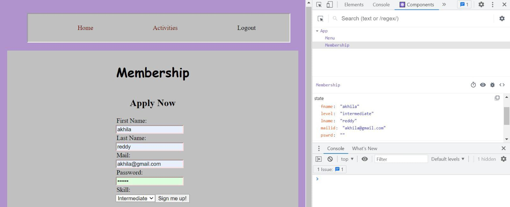
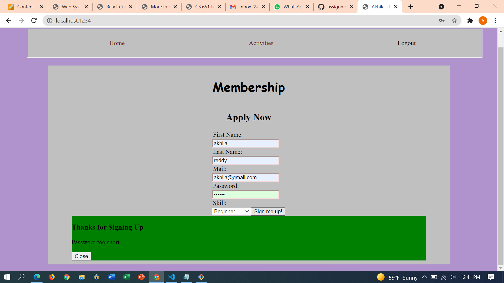
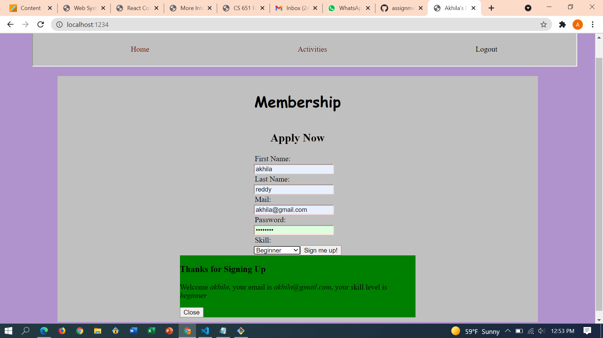
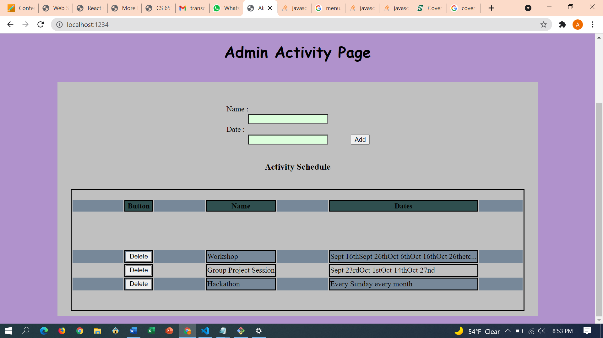
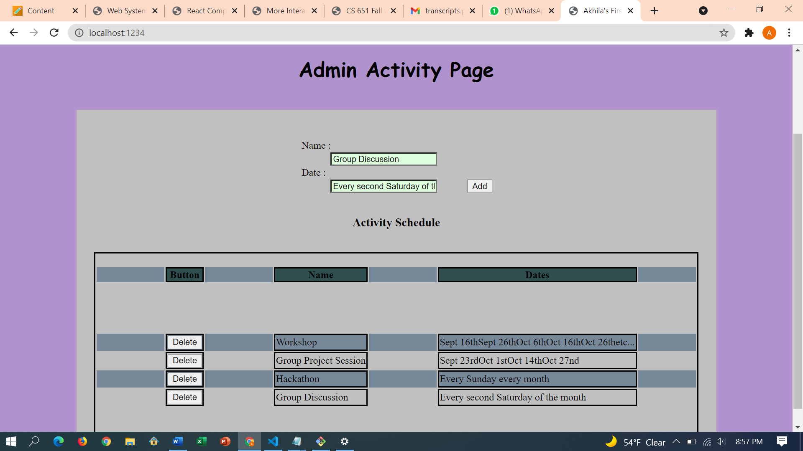

**Student Name**:  Akhila Reddy Bukkasamudram

**NetID**: cl2103

# Homework 7
## (1)
### (a)
A function menuhandle is created, sets the state of show, is passed when a call is made to the Menu component.
```jsx
    menuhandle(menuitem,event)
    {
            this.setState({show : menuitem})
    }


    render() {
        let content = <Home />;
        if (this.state.show == "home") {
            content = <><Home /></>;

        }
        else if (this.state.show == "login") {
            content = <><Login /></>;
        }
        else if (this.state.show == "membership") {
            content = <><Membership /></>;
        }
        else if (this.state.show == "activities") {
            content = <><Activities events={events} /></>;
        }
        else if(this.state.show == "adminactivity"){
            content = <><AdminActivity /></>;
        }
        

        return (
            <>
                <Menu menuhandle= {this.menuhandle.bind(this)} role={this.state.role} show={this.state.show} />
                {content}
            </>
        );
    }
```
### (b)
menu item changes the state of App and the respective page will be displayed dynamically.
```jsx
        let content = "";
        let rolename = this.props.role;
        let showname = this.props.show;
        if (rolename == "user") {
        content = <React.Fragment>
            <li className={"" + (showname == "home" ? 'active' : '')} onClick={this.props.menuhandle.bind(null,"home")}> Home </li>
            <li className={"" + (showname == "activities" ? 'active' : '')} onClick={this.props.menuhandle.bind(null,"activities")}> Activities </li >
            <li className={"" + (showname == "logout" ? 'active' : '') }> Logout </li> </React.Fragment >
        }
        else if (rolename == "guest") {
        content = <React.Fragment>
            <li className={"" + (showname == "home" ? 'active' : '')} onClick={this.props.menuhandle.bind(null,"home")}> Home  </li>
            <li className={"" + (showname == "activities" ? 'active' : '')} onClick={this.props.menuhandle.bind(null,"activities")}> Activities </li>
            <li className={"" + (showname == "membership" ? 'active' : '')} onClick={this.props.menuhandle.bind(null,"membership")}> Membership </li>
            <li className={"" + (showname == "login" ? 'active' : '')} onClick={this.props.menuhandle.bind(null,"login")} > Login </li>
        </React.Fragment>
        }
        
        return <nav>
        <ul>
            {content}
        </ul>
        </nav>;
    }
```
## (2)
### (a)
```jsx
class Membership extends React.Component {
  constructor(props){
    super(props);
    this.state = {fname: "", lname: "", mailid:"", pswrd:"",skill:"",dialogClass:""}
  }
}
```
### (b)
```javascript
<section id ="membership">
<label>First Name:</label>{" "}
<input required minLength = "6" maxLength = "30" id = "fname" type="text" value={this.state.fname} onInput = {(event)=> this.setState({fname : event.target.value})}></input>
<label>Last Name:</label>{" "}
<input required minLength = "6" maxLength = "30" id = "lname" type="text" value={this.state.lname} onInput = {(event)=> this.setState({lname : event.target.value})}></input>
<label>Mail:</label>{" "}
<input required minLength = "1" maxLength = "30" id = "mailid" type="text" value={this.state.mailid} onInput = {(event)=> this.setState({mailid : event.target.value})}></input>
<label>Password:</label>{" "}
<input required minLength = "6" maxLength = "30" id = "pswrd" type="password" value={this.state.pswrd} onInput = {(event)=> this.setState({pswrd : event.target.value})}></input>
<label>Skill:</label>
<select required id = "skill" value={this.state.skill} onInput={(event) => this.setState({ skill: event.target.value })}>
<option value="beginner">Beginner</option>
<option value="intermediate">Intermediate</option>
<option value="advanced">Advanced</option>
</select> 
<button onClick={this.submitApplication.bind(this)}>Sign me up!</button>      
</section>
```


### (c)



### (d)
```jsx
<section id="ThanksDialog" className={`wrap ${this.state.dialogClass}`}>
    <div className="wrapcenter">
    <h3>Thanks for Signing Up</h3>
    {message}
    <button onClick={(event) => this.setState({ dialogClass: "hide" })}>
        Close
    </button>
    </div>
</section>
```
```css
.wrap{
  background-color: rgba(255, 0, 0, 0.3);
  z-index: 1;
  top: 0;
  left: 0;
  position: fixed;
  height: 100%;
  width: 100%;
  display: none;
}

.wrapcenter{
      background-color: purple;
      border-color: black;
      border-radius: 1cm;
      border-width: 1cm;
      margin: auto;
      position: relative;
      max-width: 500px;
      padding: 15px;
      margin-top: 200px;
}
```


## (3)
### (a)
React Component is used.


### (b)


### (c)


### (d)
```jsx
constructor(props) {
        super(props);
        this.state = {
            name:"",
            dates:"",
            eventsArray:events
        };
 } 
```
### (e)
```jsx

<section id="AdminActivity">
                <label>Name : </label>
                <input type="text" onInput={(event) => this.setState({ name: event.target.value })} />
                <label>Date : </label>
                <input type="text" onInput={(event) => this.setState({ dates: event.target.value })} />
                <button onClick={this.addChoice.bind(this)}>Add</button></section>
```
### (f)
```jsx
addChoice(event)
{
        event.preventDefault()
            let arr = {}
            arr.name = this.state.name;
            arr.dates = this.state.dates;
            let tempArr = this.state.eventsArray;
            tempArr.push(arr);
            this.setState({eventsArray: tempArr})
}
```
## (4)

### (a)


### (b)
```jsx
<table>
<tr>
    <th>Button</th>
    <th>Name</th>
    <th>Dates</th>
</tr>
<tbody id="table">
{eventsArray.map((item, idx) => (<tr key={idx}>
    <td><button onClick={(event) => this.deleteRow(event, item)}>Delete</button></td>
    <td>{item.name}</td>
    <td>{item.dates}</td></tr>))}

</tbody>
</table>
```

### (c)
```jsx
deleteRow(event,o){
        event.preventDefault();
        let temp =this.state.eventsArray
        let index =temp.indexOf(o);
        temp.splice(index, 1);
        this.setState({eventsArray:temp})       
    }
```
### (d)
[Link to server](http://csweb01.csueastbay.edu/~cl2103/clubProjectHW7/dist/)