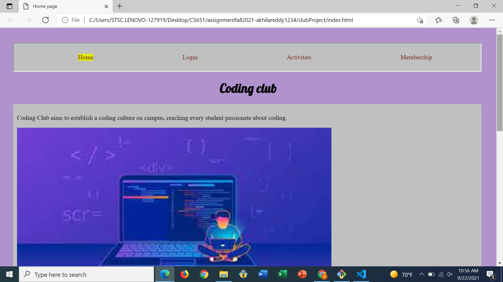
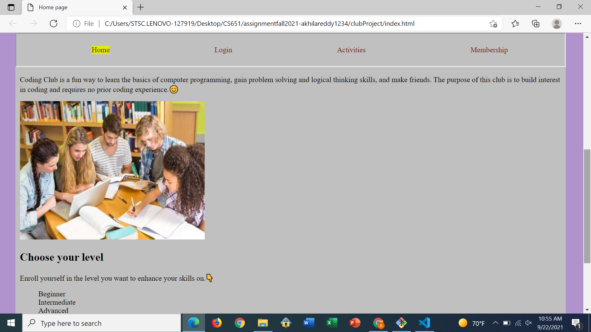
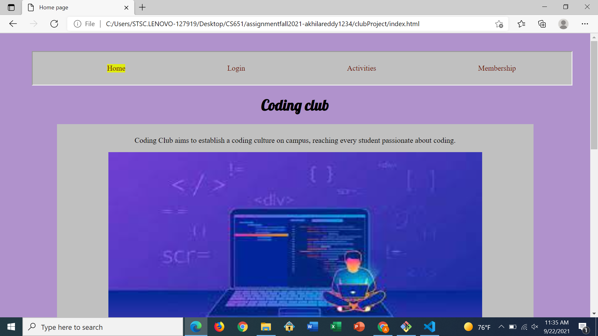
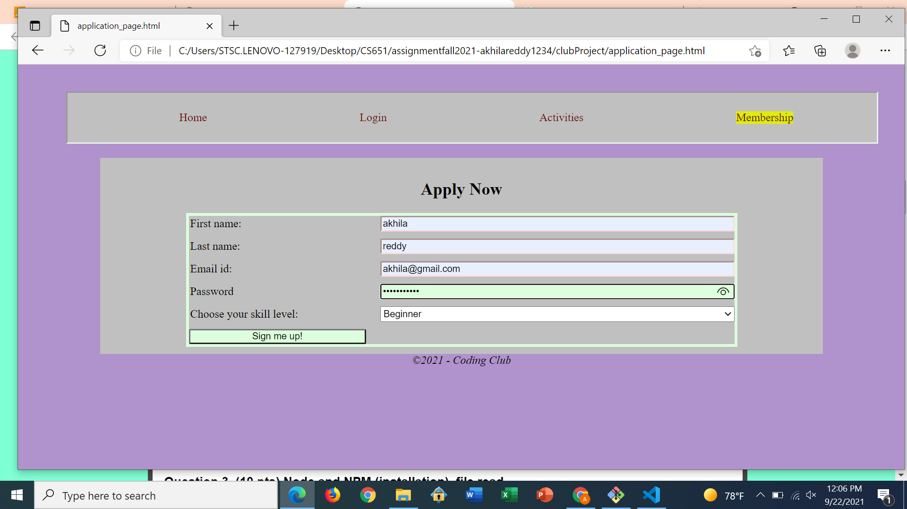
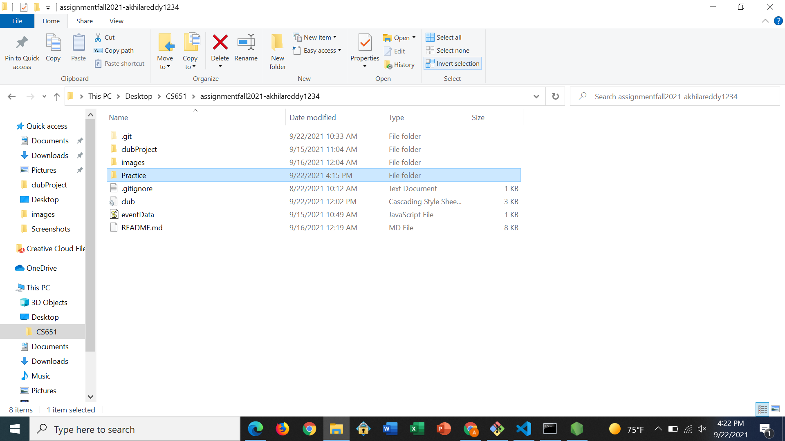
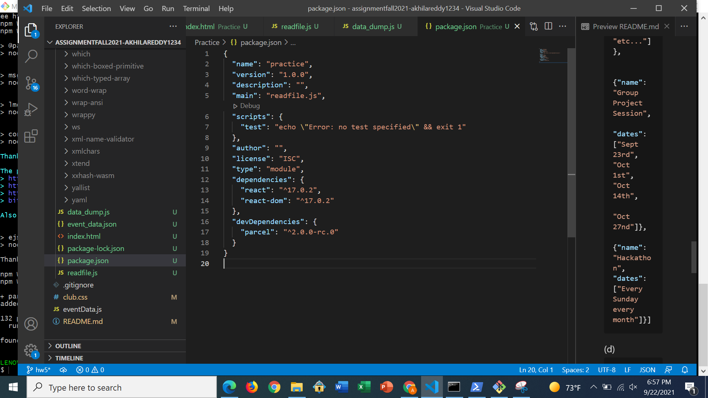
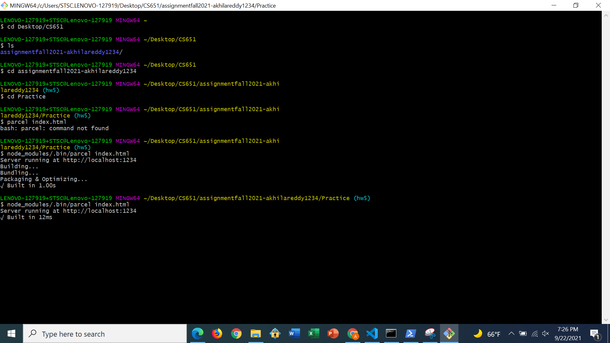
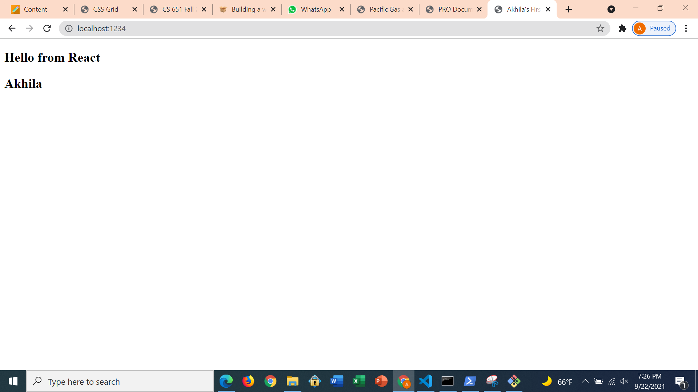
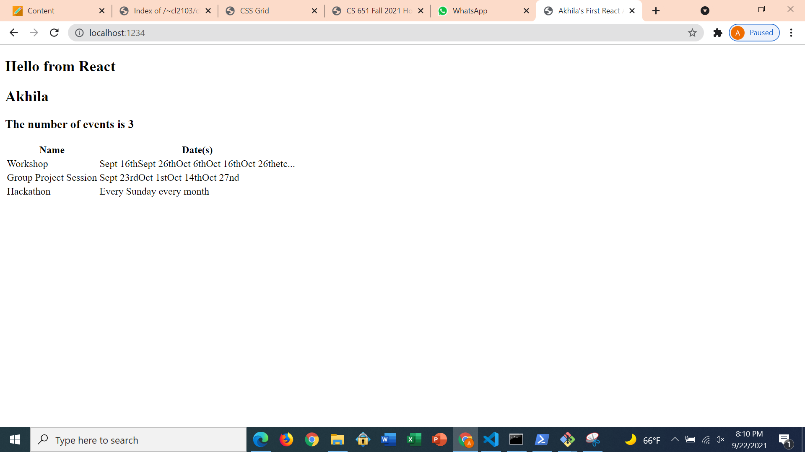

**Student Name**:  Akhila Reddy Bukkasamudram

**NetID**: cl2103

# Homework 5
## (1)
### (a)


### (b)
```html
<nav>
        <ul>
            <li class="active"><a href="./index.html">Home</a></li>
            <li><a href="./login.html">Login</a></li>
            <li><a href="./club_activities.html">Activities</a></li>
            <li><a href="./application_page.html">Membership</a></li>
        </ul>
    </nav>
```
```css
nav {
    max-width: 100%;
    border-style: inset;
    position: sticky;
    top: 0;
}

```


## (2)

### (a)
```css
main{
  max-width : 1000px;
  align-items: center;
  flex-direction: column;
  display : flex;
  margin : 0 auto;
}
```


### (b)

```css
.container {
  display:grid;
  grid-template-columns: 1fr 2fr;
  grid-row-gap: 10px;
  grid-column-gap:20px;
}
```


### (c)

[link to updated website](http://csweb01.csueastbay.edu/~cl2103/clubProjectHW5/clubProject/)

## (3)

### (a)


### (b)
```javascript
import fs from 'fs'; // File system module
let file_name = 'index.html';
var file_path = process.argv[2];
var file_buffer =  fs.readFileSync(file_name);
var to_string = file_buffer.toString();
var split_lines = to_string.split("\n");
console.log(split_lines.length-1);
```


### (c)
javascript is more restrictive.

```json
[{"name": "Workshop",
    "dates": ["Sept 16th", "Sept 26th", "Oct 6th", "Oct 16th",
              "Oct 26th", "etc..."]},

  {"name": "Group Project Session",
   "dates": ["Sept 23rd", "Oct 1st", "Oct 14th",
             "Oct 27nd"]},
  {"name": "Hackathon", "dates": ["Every Sunday every month"]}]
```

### (d)

```javascript
import { readFile } from 'fs/promises'; // promise based file reading 
const clubEvents = JSON.parse(await readFile(new URL('./event_data.json',
    import.meta.url))); // URL for relative file location, regular JSON parsing

clubEvents.forEach(function(event) { //Look at data
    console.log(event);
});

```


## (4)

### (a)
we can create package.json using the command : npm init

### (b)


### (c)

### (d)

###(e)



## (5)

### (a)


### (b)

