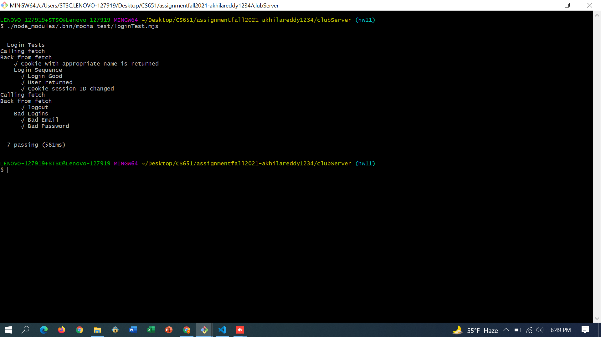
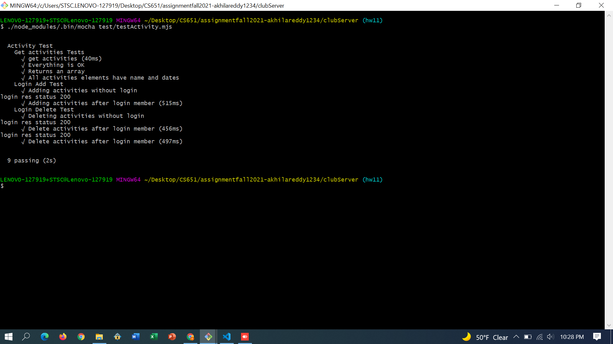

**Student Name**:  Akhila Reddy Bukkasamudram

**NetID**: cl2103

# Homework 11
## (1)
### (a)


### (b)


## (2)

```javascript
  [{"name": "Workshop",
    "dates": ["Sept 16th", "Sept 26th", "Oct 6th", "Oct 16th",
              "Oct 26th", "etc..."]},

  {"name": "Group Project Session",
   "dates": ["Sept 23rd", "Oct 1st", "Oct 14th",
             "Oct 27nd"]},
  {"name": "Hackathon", "dates": ["Every Sunday every month"]}]
  ```

  ```javascript
  {
    "$schema": "http://json-schema.org/draft-07/schema#",
    "$id": "http://locolhost:2020/activities",
    "title": "Activity Schema",
    "description": "A Schema that requires a JSON object",
    "type": "array",
    "items":
    {
        "type": "object",
        "properties":
        {
            "name": {
            "description": "name",
            "type": "string"
          
            },
            "dates": {
            "description": "date",
            "type": "array"
            }
        },
        "required": ["name", "dates"],
        "additionalProperties": false
    }
    
  }
```

## (3)
### (a)
```javascript
const handleErrors = (err, req, res, next) => {
  console.log("Harita");
  console.log(err);
  if (!err.statusCode) err.statusCode = 500;
  return res.status(err.statusCode).json({
    message: err.message,
  });
};

app.use(handleErrors);
```

### (b)
- Valid JSON Object

```json
{
  "name": "Akhila",
  "email": "bukkasamudramakhila@gmail.com",
  "password": "leavemealone123",
  "membershipType": "premium",
  "comments":"No comments",
}
```

- JSON Schema

```json
{
  "$id": "http://json-schema.org/draft-04/schema#",
  "$schema": "http://json-schema.org/draft-04/schema#",
  "type": "object",
  "properties": {
    "name": {
      "type": "string"
    },
    "email": {
      "type": "string"
    },
    "password": {
      "type": "string"
    },
    "membershipType": {
      "type": "string"
    },
    "comments": {
      "type": "string"
    }
  },
  "required": [
    "name",
    "email",
    "password",
    "membershipType",
    "comments"
  ]
}
```
### (c)

```javascript
app.post("/applicants", function (req, res) {
  let applicantValidate = ajv.compile(applicantSchema);
  const valid = applicantValidate(req.body);
  if (!valid) {
    res.status(401);
    var returnData = { error: true, message: valid.errors };
    res.send(returnData);
  } else {
    var data = [];
    data.push(req.body);
    res.send(data);
  }
})
```