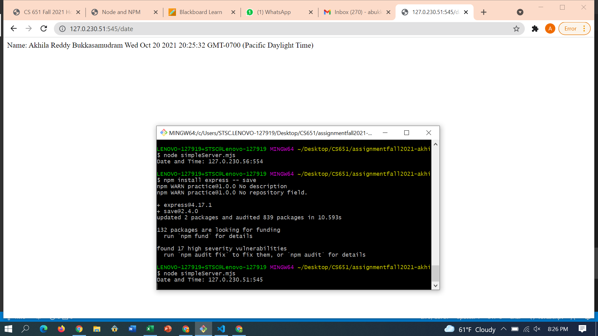
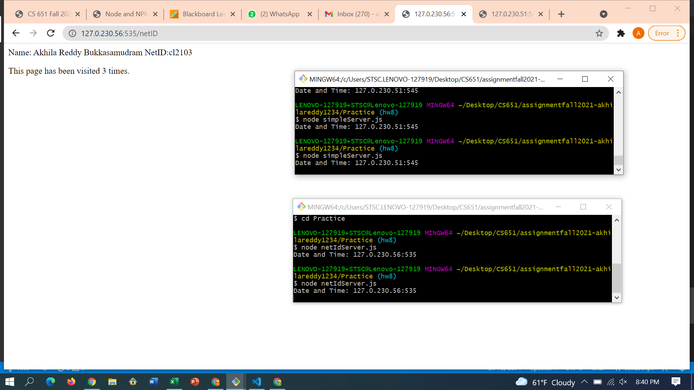
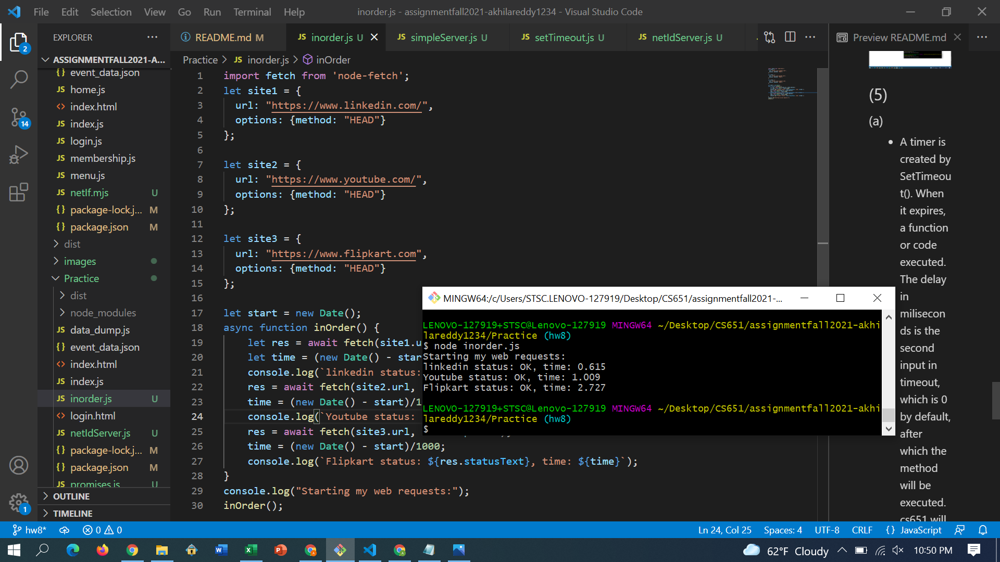
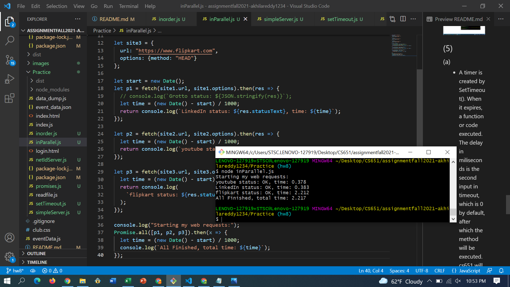

**Student Name**:  Akhila Reddy Bukkasamudram

**NetID**: cl2103

# Homework 8
## (1)
### (a)
Wi-Fi
[
  {
    address: '10.0.0.98',
    netmask: '255.255.255.0',
    family: 'IPv4',
    mac: '8c:c6:81:6b:39:29',
    internal: false,
    cidr: '10.0.0.98/24'
  }
]
Loopback Pseudo-Interface 1
[
  {
    address: '127.0.0.1',
    netmask: '255.0.0.0',
    family: 'IPv4',
    mac: '00:00:00:00:00:00',
    internal: true,
    cidr: '127.0.0.1/8'
  }
]

### (b)
* An IP address is used to establish a link between devices that send and receive data over a network. 
* Ethernet is a method of connecting computers to a network using a wired connection. So we employ ethernet in a few select networks only.

### (c)
https://developer.mozilla.org/en-US/docs/Web/JavaScript/Guide/Grammar_and_Types#Comments

Protocol : https://
Domain : developer.mozilla.org
Path : docs/Web/JavaScript/Guide/Grammar_and_Types
Fragment : #Comments

https://www.google.com/search?q=gaia+mission&rlz=1CYPO_enUS751

Protocol : https://
Domain : google.com
Path: search
Query : ?q=gaia+mission&rlz=1CYPO_enUS751

http://127.0.0.2:8282/static/index.html

Protocol : http://
Domain : 127.0.0.2
Port : 8282
Path : static/index.html

## (2)
### (a)
1. POST method is used in the request.
2. response code is 200 Ok and it means request is successful and things worked.
3. HTTP/1.1 version is used.

### (b)
POST /events/1/232bf20b67?a=25577677&v=1211.ba193a8&to=M1NbN0oCDxFYU0JaXAoZahdKFhUReFNCWlwKGVsPWQAKAFZRRFcdE1NbAkgTEkxbXFdQWAZZWBFcTQAXTVhTXUcNVVgXUQwPTHVfUVpdJVVNClcN&rst=10562&ck=1&ref=https://bb.csueastbay.edu/ HTTP/1.1
Host: bam-cell.nr-data.net
Connection: keep-alive
Content-Length: 152
sec-ch-ua: "Chromium";v="94", "Google Chrome";v="94", ";Not A Brand";v="99"
sec-ch-ua-mobile: ?0
User-Agent: Mozilla/5.0 (Windows NT 10.0; Win64; x64) AppleWebKit/537.36 (KHTML, like Gecko) Chrome/94.0.4606.81 Safari/537.36
sec-ch-ua-platform: "Windows"
content-type: text/plain
Accept: */*
Origin: https://bb.csueastbay.edu
Sec-Fetch-Site: cross-site
Sec-Fetch-Mode: cors
Sec-Fetch-Dest: empty
Referer: https://bb.csueastbay.edu/
Accept-Encoding: gzip, deflate, br
Accept-Language: en-US,en;q=0.9
Cookie: JSESSIONID=a764b7171f1c59f9

### (c)
HTTP/1.1 200 OK
Date: Thu, 21 Oct 2021 00:08:08 GMT
Content-Type: image/gif
Content-Length: 24
Connection: keep-alive
CF-Ray: 6a163fecbe640231-SJC
Access-Control-Allow-Origin: https://bb.csueastbay.edu
CF-Cache-Status: DYNAMIC
access-control-allow-credentials: true
access-control-allow-methods: GET, POST, PUT, HEAD, OPTIONS
Expect-CT: max-age=604800, report-uri="https://report-uri.cloudflare.com/cdn-cgi/beacon/expect-ct"
Vary: Accept-Encoding
Server: cloudflare

### (d)
Blackboard is based on cloudflare.
JSESSIONID cookie is set.

## (3)

### (a)
DNS Servers:
[
  '75.75.75.75',
  '75.75.76.76',
  '2001:558:feed::1',
  '2001:558:feed::2'
]

### (b)
Address for www.shein.com
[
  '184.26.53.136',
  '184.26.53.146',
  '184.26.53.145',
  '184.26.53.137',
  '184.26.53.217',
  '184.26.53.219',
  '184.26.53.224',
  '184.26.53.154',
  '184.26.53.144'
]

## (4)

### (a)

### (b)

## (5)

### (a)
* A timer is created by SetTimeout(). When it expires, a function or code executed. The delay in miliseconds is the second input in timeout, which is 0 by default, after which the method will be executed. cs651 will be displayed first as the delay in function cs351 is likewise zero. Therefore both functions have the same delay time, the first one called will print first.
* Hence CS651 will be printed first and then CS351.

### (b)

* Three functions randomly are run by the code and returns a function that is executed first using "then" method.

### (c)

### Inorder

### (d)

### InParallel

