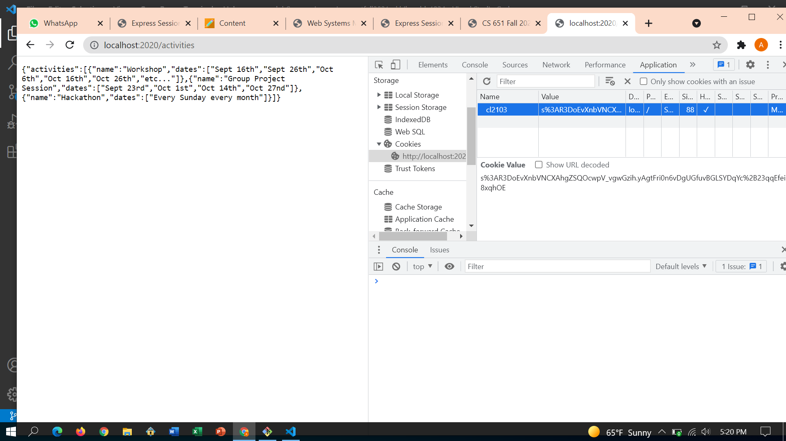
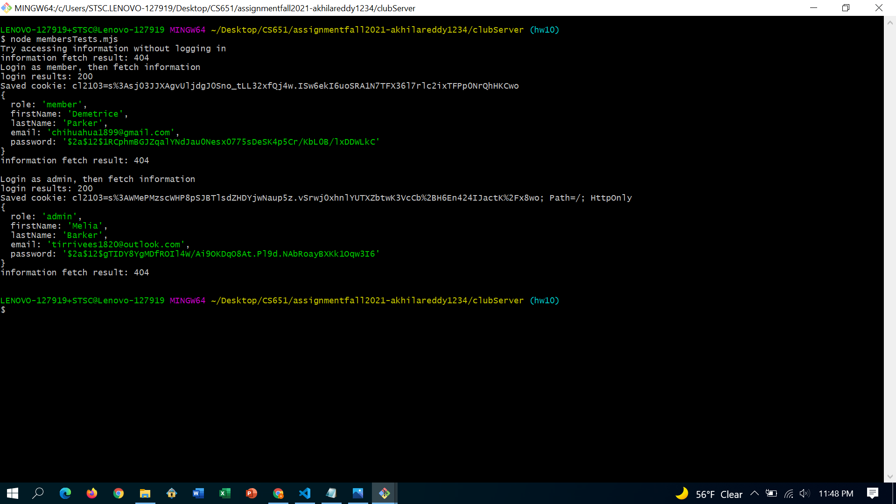
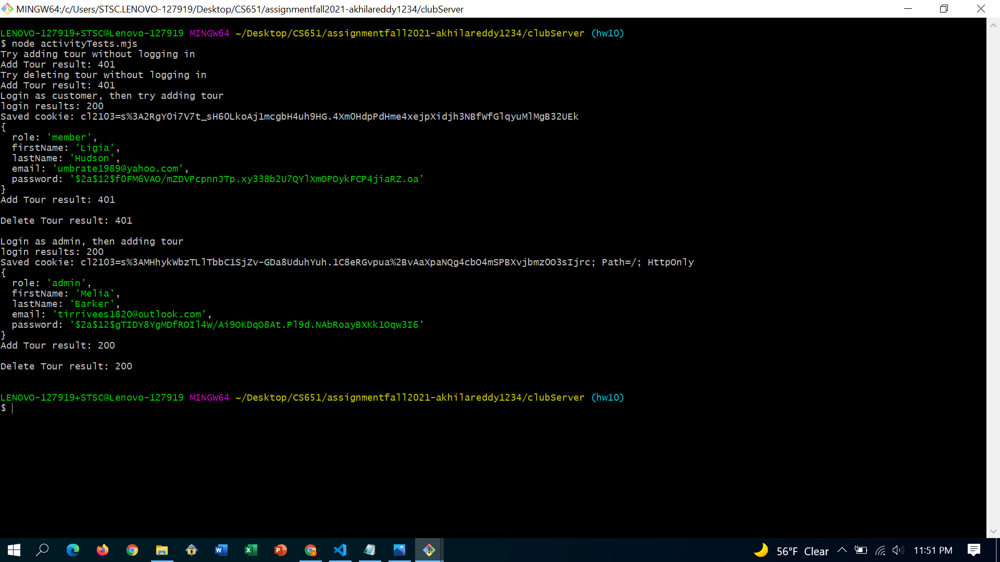

**Student Name**:  Akhila Reddy Bukkasamudram

**NetID**: cl2103

# Homework 10
## (1)
### (a)
```javascript
const cookieName = "cl2103"; // Session ID cookie name, use this to delete cookies too.
app.use(session({
    secret: 'Coding Club',
    resave: false,
    saveUninitialized: false,
    name: cookieName // Sets the name of the cookie used by the session middleware
}));


// This initializes session state
function setUpSessionMiddleware(req, res, next) {
    console.log(`\nsession object: ${JSON.stringify(req.session)}`);
    console.log(`session id: ${req.session.id}`);
    if (!req.session.user) {
        req.session.user = { role: "guest" };
    };
    next();
};

app.use(setUpSessionMiddleware);
```

### (b)


### (c)
```javascript
app.post('/login', express.json(), function(req, res) {
    let email = req.body.email;
    let password = req.body.password;
    // Find user
    let auser = users.find(function(user) {
        return user.email === email
    });
    if (!auser) { // Not found
        res.status(401).json({ error: true, message: "User/Password error" });
        return;
    }
    let verified = bcrypt.compareSync(password, auser.passHash);
    if (verified) {
        // Upgrade in priveledge, should generate new session id
        // Save old session information if any, create a new session
        let oldInformation = req.session.user;
        req.session.regenerate(function(err) {
            if (err) {
                console.log(err);
            }
            let newUserInformation = Object.assign(oldInformation, auser);
            delete newUserInformation.passHash;
            req.session.user = newUserInformation;
            res.json(newUserInformation);
        });
    } else {
        res.status(401).json({ error: true, message: "User/Password error" });
    }
});
```
### (d)
```javascript
app.get('/logout', function (req, res) {
    let options = req.session.cookie;
    req.session.destroy(function (err) {
        if (err) {
            console.log(err);
        }
        res.clearCookie(cookieName, options); // the cookie name and options
        res.json({message: "Goodbye"});
    })
});
```
## (2)
### (a)
```javascript
function checkCustomerMiddleware(req, res, next) {
    if (req.session.user.role === "member") {
        res.status(401).json({ error: "Not permitted" });;
    } else {
        //      console.log(`\nSession info: ${JSON.stringify(req.session)} \n`);
        next();
    }
};
```
### (b)
```javascript
function checkAdminMiddleware(req, res, next) {
    if (req.session.user.role !== "admin") {
        res.status(401).json({ error: "Not permitted" });;
    } else {
        next();
    }
};
```
## (3)
### (a)

```javascript
import fetch from "node-fetch";

let urlBase="http://localhost:2020/"

function extractCookies(rawStrings) {
    let cookies = [];
    rawStrings.forEach(function(ck) {
        cookies.push(ck.split(";")[0]); 
    });
    return cookies.join(";"); 
}

let membertest = {
    url: urlBase + "user",
    options: {
        method: "get",
        headers: {"Content-Type": "application/json"},
    },
};

let loginAdmin = {
    url: urlBase + "login",
    options: {
        method: "POST",
        body: JSON.stringify({
            
            email: "tirrivees1820@outlook.com",
            password: "449OqspUq",
        }),
        headers: { "Content-Type": "application/json" },
    },
};

let loginCust = {
    url: urlBase + "login",
    options: {
        method: "POST",
        body: JSON.stringify({
            
            email: "chihuahua1899@gmail.com",
            password: "9E3423Gj3iJ",
        }),
        headers: { "Content-Type": "application/json" },
    },
};

async function someTests() {
    console.log("Try accessing information without logging in");
    try {
        let res = await fetch(membertest.url, membertest.options);
        console.log(`information fetch result: ${res.status}`);
    } catch (e) {
        console.log(`Error: ${e}\n`);
    }

    

    console.log("Login as member, then fetch information");
    try {
        let res = await fetch(loginCust.url, loginCust.options);
        console.log(`login results: ${res.status}`);
        // Look at the cookie
        let savedCookie = extractCookies(res.headers.raw()["set-cookie"]);
        console.log(`Saved cookie: ${savedCookie}`);
        membertest.options.headers.cookie = savedCookie;
        // User info from login
        let userInfo = await res.json();
        console.log(userInfo);
        res = await fetch(membertest.url, membertest.options);
        console.log(`information fetch result: ${res.status}\n`);
      
    } 
    catch (e) {
        console.log(`Error: ${e}\n`);
    }

    console.log("Login as admin, then fetch information");
    try {
        let res = await fetch(loginAdmin.url, loginAdmin.options);
        console.log(`login results: ${res.status}`);
        // Look at the cookie
        let savedCookie = extractCookies(res.headers.raw()["set-cookie"]);
        console.log(`Saved cookie: ${res.headers.raw()["set-cookie"]}`);
        membertest.options.headers.cookie = savedCookie;
        // User info from login
        let userInfo = await res.json();
        console.log(userInfo);
        res = await fetch(membertest.url, membertest.options);
        console.log(`information fetch result: ${res.status}\n`);
    } catch (e) {
        console.log(`Error: ${e}\n`);
    }
}

someTests();
```

### (b)

```javascript
import fetch from "node-fetch";
const user={
    "name": "Sample tests",
    "dates": ["February 7th", "March 7th"
    ]
};
let urlBase="http://localhost:2020/"

function extractCookies(rawStrings) {
    let cookies = [];
    rawStrings.forEach(function(ck) {
        cookies.push(ck.split(";")[0]); // Just grabs cookie name=value part
    });
    return cookies.join(";"); // If more than one cookie join with ;
}

let addTour = {
    url: urlBase + "activities",
    options: {
        method: "POST",
        headers: {"Content-Type": "application/json"},
        body: JSON.stringify(user)
    },
};
let del = {
    url: urlBase + "activities/3",
    options: {
        method: "delete",
        headers: {"Content-Type": "application/json"},
    },
};

let loginAdmin = {
    url: urlBase + "login",
    options: {
        method: "POST",
        body: JSON.stringify({
            // admin user, see users.json file
            email: "tirrivees1820@outlook.com",
            password: "449OqspUq",
        }),
        headers: { "Content-Type": "application/json" },
    },
};

let loginCust = {
    url: urlBase + "login",
    options: {
        method: "POST",
        body: JSON.stringify({
            // admin user, see users.json file
            email: "umbrate1989@yahoo.com",
            password: "1n3pLS47yH",
        }),
        headers: { "Content-Type": "application/json" },
    },
};

async function someTests() {
    console.log("Try adding tour without logging in");
    try {
        let res = await fetch(addTour.url, addTour.options);
        console.log(`Add Tour result: ${res.status}`);
    } catch (e) {
        console.log(`Error: ${e}\n`);
    }

    console.log("Try deleting tour without logging in");
    try {
        let res = await fetch(del.url, del.options);
        console.log(`Add Tour result: ${res.status}`);
    } catch (e) {
        console.log(`Error: ${e}\n`);
    }

    console.log("Login as customer, then try adding tour");
    try {
        let res = await fetch(loginCust.url, loginCust.options);
        console.log(`login results: ${res.status}`);
        // Look at the cookie
        let savedCookie = extractCookies(res.headers.raw()["set-cookie"]);
        console.log(`Saved cookie: ${savedCookie}`);
        addTour.options.headers.cookie = savedCookie;
        // User info from login
        let userInfo = await res.json();
        console.log(userInfo);
        res = await fetch(addTour.url, addTour.options);
        console.log(`Add Tour result: ${res.status}\n`);
        del.options.headers.cookie = savedCookie;
        res = await fetch(del.url, del.options);
        console.log(`Delete Tour result: ${res.status}\n`);
        
    } catch (e) {
        console.log(`Error: ${e}\n`);
    }

    console.log("Login as admin, then adding tour");
    try {
        let res = await fetch(loginAdmin.url, loginAdmin.options);
        console.log(`login results: ${res.status}`);
        // Look at the cookie
        let savedCookie = extractCookies(res.headers.raw()["set-cookie"]);
        console.log(`Saved cookie: ${res.headers.raw()["set-cookie"]}`);
        addTour.options.headers.cookie = savedCookie;
        // User info from login
        let userInfo = await res.json();
        console.log(userInfo);
        res = await fetch(addTour.url, addTour.options);
        console.log(`Add Tour result: ${res.status}\n`);
        del.options.headers.cookie = savedCookie;
        res = await fetch(del.url, del.options);
        console.log(`Delete Tour result: ${res.status}\n`);
        
    } catch (e) {
        console.log(`Error: ${e}\n`);
    }
}

someTests();
```

## (4)

### (a) Specify Activity Interfaces
```
Club Activities interface
HTTP method: GET
URL: HTTP GET http://localhost:2020/activities

success and error codes: 200 (OK), 404 (NOT FOUND), 400 (BAD REQUEST)
a sample of data to be sent and/or received: "names": "Basic Practice"
who should be allowed to use this interface (guest, member, admin): member and admin

Add Club Activities interface
HTTP method: POST 
URL: HTTP POST http://localhost:2020/addThing  success and error codes: 200 (OK), 201 (Created), 204 (No Content) 
a sample of data to be sent and/or received: {"name": "Basic Warm Up", "dates" : ["10:00AM IST"]} 
who should be allowed to use this interface (guest, member, admin): Admin

Delete Club Activities interface
HTTP method: DELETE
URL: HTTP DELETE http://localhost:2020/removeThing
success and error codes: 405 (Method not allowed), 200 (OK), 404 (Not Found)
a sample of data to be sent and/or received: {"name": "Basic Warm Up", "dates" : ["10:00AM IST"] 
who should be allowed to use this interface (guest, member, admin): Admin
```
### (b) Specify Member Interfaces
```
all club members
HTTP method: GET
URL: HTTP GET http://localhost:2020/users 
success and error codes:200 (OK), 404 (NOT FOUND), 400 (BAD REQUEST) 
a sample of data to be sent and/or received: list of all members 
who should be allowed to use this interface: Admin

Adding a new club member
HTTP method: POST
URL: HTTP POST http://localhost:2020/addUser 
success and error codes: 200 (OK), 201 (Created), 204 (No Content) 
a sample of data to be sent and/or received: Mr. Sunny 
who should be allowed to use this interface: Admin

Updating a club member HTTP method: PUT URL: HTTP PUT http://localhost:2020/users/123 
success and error codes: 405 (Method not allowed), 200 (OK) or 204 (No Content), 404 (Not Found) 
a sample of data to be sent and/or received: Mr Honey to Mr. Twinkle 
who should be allowed to use this interface: member, Admin

Deleting a club member HTTP method: DELETE URL: HTTP DELETE http://127.0.0.1:7797/deleteUser 
success and error codes: 405 (Method not allowed), 200 (OK), 404 (Not Found) 
a sample of data to be sent and/or received: Delete Mr. Dimple 
who should be allowed to use this interface: member, Admin
```

### (c) Specify Applicant Interfaces
```
Club applicants HTTP method: GET 
URL: HTTP GET http://localhost:2020/applicants
success and error codes: 200 (OK), 404 (NOT FOUND), 400 (BAD REQUEST) 
a sample of data to be sent and/or received: list of all applicants
who should be allowed to use this interface: Admin

Adding new club applicant
HTTP method: POST 
URL: HTTP POST http://localhost:2020/addApplicant 
success and error codes: 200 (OK), 201 (Created), 204 (No Content) 
a sample of data to be sent and/or received: Mr. Motu 
who should be allowed to use this interface: Admin

deleting club applicant 
HTTP method: DELETE URL: HTTP DELETE http://localhost:2020/deleteApplicant 
success and error codes: 405 (Method not allowed), 200 (OK), 404 (Not Found) 
a sample of data to be sent and/or received: delete Mr. Zoe 
who should be allowed to use this interface: Admin
```