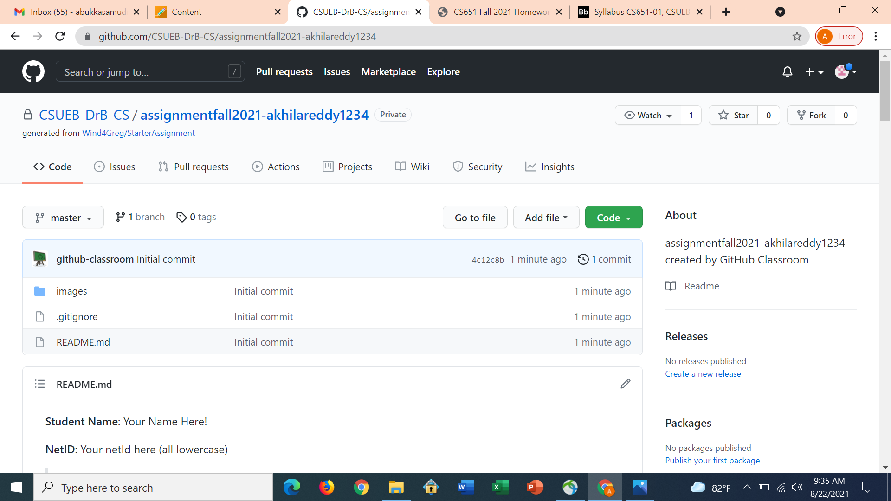
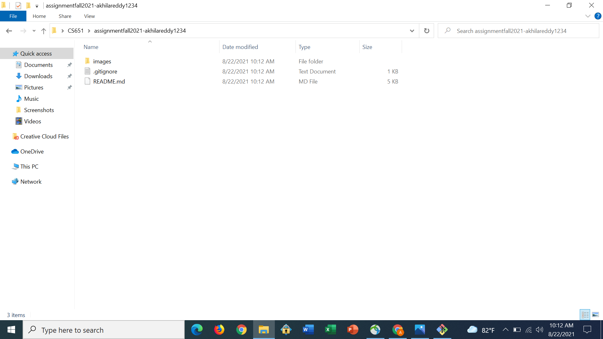
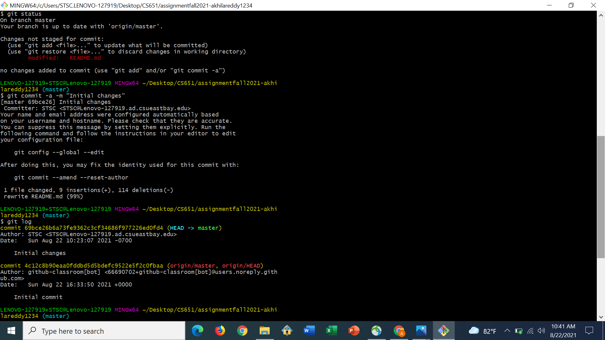
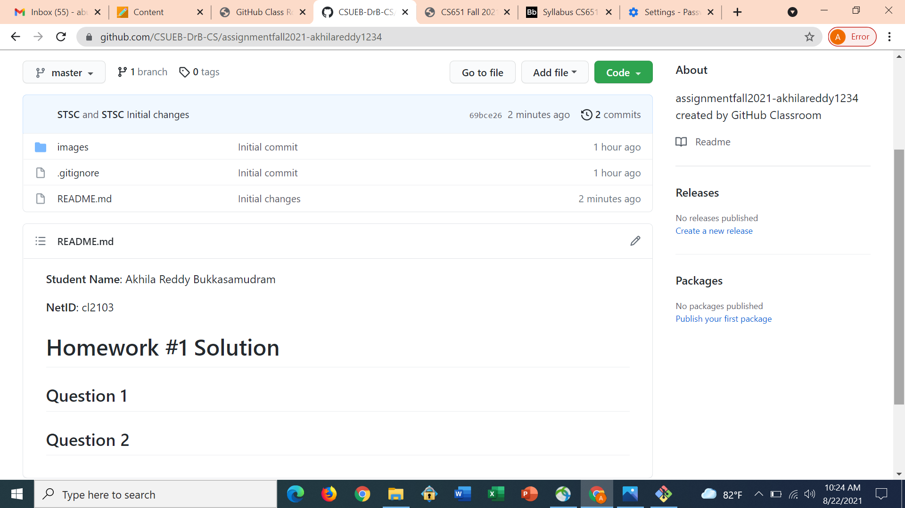

**Student Name**:  Akhila Reddy Bukkasamudram

**NetID**: cl2103

# Homework #1 Solution

## Question 1

### (a)



### (b)




## Question 2

### (a)

### (b)



### (c)



## Question 3

### (a)

### (b)

## Question 4

### (a)

1. Java
2. Python
2. C

### (b)

* Windows
* Linux

### (c)

* Eclipse
* Vim

## Question 5

### (a) Java Example

```java example

import java.util.*;
class Example{
	public static void main(String args[]){
		Scanner sc = new Scanner(System.in);
		int[] a = new int[5];
		for(int i = 0; i < 5; i++){
			a[i] = sc.nextInt();
		}
		System.out.println("Elements in the array are : ");
		for(int i = 0; i < 5; i++){
			System.out.println(a[i]);
		}
	}
}

```

### (b) 

Eclipse IDE is a software which provides a development environment that is primarily used to run java applications and web based applications.
[link to Eclipse download](https://www.eclipse.org/downloads/packages/release/kepler/sr1/eclipse-ide-java-developers)