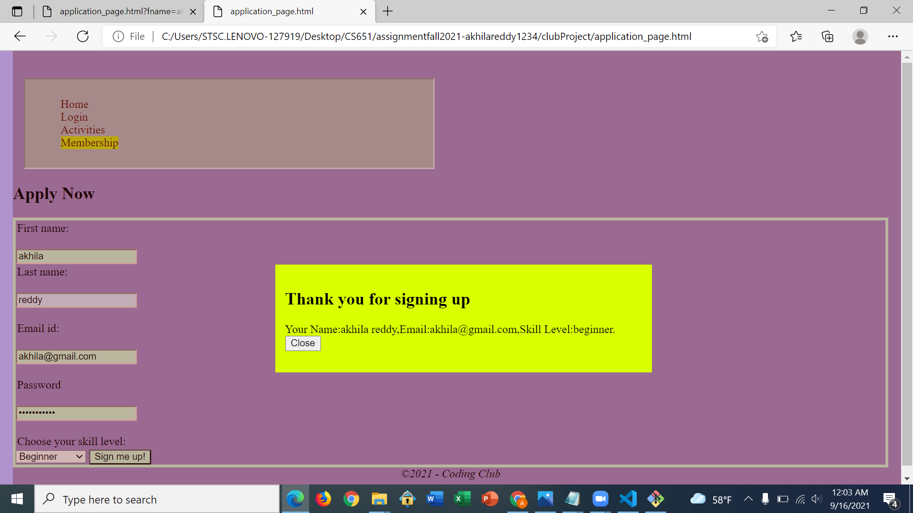

**Student Name**:  Akhila Reddy Bukkasamudram

**NetID**: cl2103

# Homework 4
## (1)

### (a)

```
events = [{"name": "Workshop",
           "dates": ["Sept 16th", "Sept 26th", "Oct 6th", "Oct 16th",
                     "Oct 26th", "etc..."]},
         {"name": "Group Project Session",
          "dates": ["Sept 23rd", "Oct 1st", "Oct 14th",
                    "Oct 27nd"]},
         {"name": "Hackathon", "dates": ["Every Sunday every month"]}];
    
```

### (b)

### (c)

```
<script>
            let table = document.getElementById('activity_table');
            events.forEach(function(a) {
            let tr = document.createElement('tr');
            tr.innerHTML = '<td>' + a.name + '</td>' +'<td>' + a.dates + '</td>';
            table.appendChild(tr);
        });
</script>
```


## (2)

### (a)


### (b)

```
<nav>
    <ul>
        <li><a href="./index.html">Home</a></li>
        <li><a href="./login.html">Login</a></li>
        <li><a href="./club_activities.html">Activities</a></li>
        <li class="active"><a href="./application_page.html">Membership</a></li>
    </ul>
</nav>

```


## (3)

### (a)

```html
<section style="border:rgb(20, 1, 1); border-width:8px;border-style:dashed; background-color: rgb(11, 180, 144);"> 
        <div class="center">
            <h1><b>Doodle!!</b></h1>
        </div>
        <input type="button" value="Add" id="add">
        <input type="button" value="clear" id="clear">
        <br>
        <section style="border:rgb(14, 132, 165); border-width:2px; border-style:inset; height: 12cm; background-color: rgb(255, 255, 255);">
        <svg id=svid width=1200 height=500 ></svg>
        <br/>
        </section>
</section>

```


### (b)
```javascript
<script>
        var mySVG = document.getElementById("svid");
        var addi = document.getElementById("add");
        var maxSize = 50,
        maxX = 1100,
        maxY = 400;
        addi.addEventListener("click",randomEllipse)
        function randomEllipse() {
            let x = Math.random()*(maxX - maxSize);
            let y = Math.random()*(maxY - maxSize);
  
            let width = Math.random()*maxSize;
            let height= Math.random()*maxSize;
            let ellipse = document.createElementNS("http://www.w3.org/2000/svg", "ellipse");
            ellipse.setAttribute("cx", x);
            ellipse.setAttribute("cy", y);
            ellipse.setAttribute("rx" , width);
            ellipse.setAttribute("ry",height);

        let colorStr = `rgb(${255*Math.random()}, ${255*Math.random()}, ${255*Math.random()})`;
        ellipse.setAttribute("fill", colorStr);
        ellipse.setAttribute("fill-opacity", 0.7);
        mySVG.appendChild(ellipse);
        }
        let clear = document.getElementById("clear")
        clear.addEventListener('click', clearall);
        function clearall(){
            let svg = document.getElementById('svid');
            svg.innerHTML="";
        }
    </script>
```


## (4)

### (a)
```html
<form action=>
  <label for="fname">First name:</label><br>
  <input type="text" id="fname" name="fname" required><br>
  <label for="lname">Last name:</label><br>
  <input type="text" id="lname" name="lname" required><br><br>
  <label for="mailid">Email id:</label><br>
  <input type="email" id="mailid" name="mailid" required><br><br>
  <label for="pswrd">Password</label><br>
  <input type="password" id="pswrd" name="pswrd" minlength="8" maxlength="12" required><br><br>
  <label for="skill">Choose your skill level:</label>
  <select name="skill" id="skill">
    <option value="beginner">Beginner</option>
    <option value="intermediate">Intermediate</option>
    <option value="advanced">Advanced</option>
  </select>

  <input type="submit" value="Sign me up!">
</form>
```


### (b)
```javascript


<script>
    let signupv = document.getElementById("signid")
    signupv.addEventListener('click', signupfunction);
    let section = document.getElementById("ThanksDialog")
    
    function signupfunction()
        {
            
            let fname = document.getElementById("fname")
            let lname = document.getElementById("lname")
            let mailid = document.getElementById("mailid")
            let skill = document.getElementById("skill")
            
            

            let p = document.createElement('p');
                p.innerHTML = '<h1><b>Thank you for signing up</b></h1>' + 'Your Name' + ':' +
                fname.value + ' ' + lname.value + ',' +  'Email' + ':'
                + mailid.value + ',' + 'Skill Level'+
                ':' + skill.value + '.' +'<button type="button" id=closeid>Close</button>';
            

            section.appendChild(p);
            section.classList.add("show");
            
            
            let closev = document.getElementById("closeid");
            closev.addEventListener('click', clearfunction);
        }

        function clearfunction()
        {
            section.classList.remove("show");
            section.innerHTML = "";
        }
</script>
```


### (c)
```css
.wrap{
    background-color: rgba(107, 13, 13, 0.3);
    z-index: 1;
    top: 0;
    position: fixed;
    height: 100%;
    width: 100%;
    display: none;
}

.wrapcenter{
        background-color: rgb(217, 255, 0);
        margin: auto;
        position: relative;
        max-width: 500px;
        padding: 14px;
        margin-top: 300px;
}
```

```javascript
<script>
    function logSubmit(event) {
        event.preventDefault();
        ThankDialog.innerHTML = "name:"+form.fname.value+",email:"+form.mailid.value;
    }   

    const form = document.getElementById('membership');
    const ThankDailog = document.getElementById('ThankDialog');
    form.addEventListener('submit', logSubmit);
</script>
<script>
    let signupv = document.getElementById("signid")
    signupv.addEventListener('click', signupfunction);
    let section = document.getElementById("ThanksDialog")
    let secWrap = document.getElementById("ThanksDialogWrapper")
    function signupfunction()
        {
            
            let fname = document.getElementById("fname")
            let lname = document.getElementById("lname")
            let mailid = document.getElementById("mailid")
            let skill = document.getElementById("skill")
            
            

            let p = document.createElement('p');
                p.innerHTML = '<h1><b>Thank you for signing up</b></h1>' + 'Your Name' + ':' +
                fname.value + ' ' + lname.value + ',' +  'Email' + ':'
                + mailid.value + ',' + 'Skill Level'+
                ':' + skill.value + '.' +'<button type="button" id=closeid>Close</button>';
            

            section.appendChild(p);
            secWrap.classList.add("show");
            
            
            let closev = document.getElementById("closeid");
            closev.addEventListener('click', clearfunction);
        }

        function clearfunction()
        {
            secWrap.classList.remove("show");
            section.innerHTML = "";
        }
</script>
```



## (5)
[Link to server with updated website](http://csweb01.csueastbay.edu/~cl2103/clubProjectHW4/)
