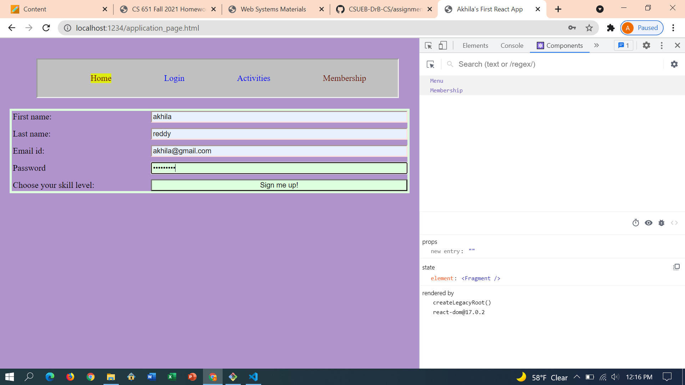

**Student Name**:  Akhila Reddy Bukkasamudram

**NetID**: cl2103

# Homework 6
## (1)
### (a)

### (b)
filename : menu.js


### (c)
filename : home.js


## (2)
### (a)
filename : activities.js

```javascript
import React from "react";
import ReactDOM from "react-dom";
function Activities(props){
    let tableC = props.events.map((e) =>{
        return (<><tr>
            <td> {e.name} </td>
            <td> {e.dates} </td>
            </tr></>)
    });
    return (<>
    <main>
        <table id="activity_table">
    <thead>
      <tr>
        <th>Name</th>
        <th>Date</th>
        
      </tr>
    </thead>
    <tbody>
        {tableC}
    </tbody>          
  </table>
  </main>
  <footer>
      &copy;2021 - Coding Club
  </footer></>)

}
export default Activities;
```
### (b)
filename : login.js

### (c)
filename : membership.js


## (3)
### (a)

### (b)

```javascript
render() {
        let content ;
        // statements/logic to set the content variable based on state
        if(this.state.show=="home")
        {
            content = <Home />;
        }
        else if(this.state.show == "activities"){
            content = <Activities events={events} />;
        }
        else if(this.state.show == "membership"){
            content = <Membership />;
        }
        
        return (
            <>
                <Menu/>
                {content}
            </>
        );
    }
```

## (4)
### (a)

1. Guest
 * Home
 * Activities
 * Login
 * Membership

2. User
 * Home
 * Activities
 * Logout

3. Admin
 * Home
 * Activities
 * Logout

### (b)


### (c)


```javascript
import React from "react";
import ReactDOM from "react-dom";
function Menu(props){
    return <nav>
    <ul>
        {props.role == "user" ? <li className={props.show == 'home' ? 'active' : ''}><a href="./index.html">Home</a></li> : ""}
        {props.role == "guest" ? <li className={props.show == 'login' ? 'active' : ''}><a href="./login.html">Login</a></li> : ""}
        {props.role == "user" ? <li className={props.show == 'activities' ? 'active' : ''}><a href="./club_activities.html">Activities</a></li> : "" }
        {props.role == "guest" ? <li className={props.show == 'membership' ? 'active' : ''}><a href="./application_page.html">Membership</a></li> : ""}
        {props.role == "user" ? <li className={props.show =='logout' ? 'active' : ''}><a>Logout</a></li> : ""}
    </ul>
</nav>;
}
export default Menu;
```
